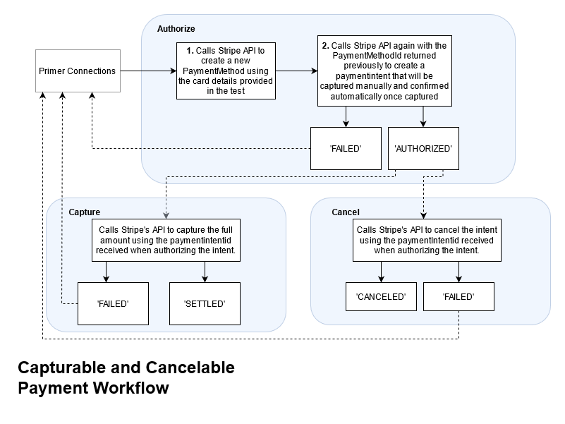

<div align="center">
[](https://primer.io)
</div>

<h1 align="center">
    Stripe Connection
</h1>

<p align="center">
Workflow to create a capturable and cancelable card  payment intent in GBP  using the Stripe API 💳💷
</p>
<br />

Detailed research and development work has been documented in the [CHANGELOG.MD](/CHANGELOG.MD).

## 📦 Pre-requisites

For this project you'll need to install:

- [Node.js > 12.x](https://nodejs.org/en/)
- [Yarn package manager](https://classic.yarnpkg.com/en/docs/install#debian-stable)

To install the dependencies you can run

```bash
yarn install
```
The code is available the [connections](connections/) folder :tada:

## 👩‍💻 How to develop upon this work

First thing's first, you'll need to fork this repo. :fork_and_knife:

Add your Stripe credentials to a file named `.env` in the root of the project, this file should look like:

```
PK_TEST=pk_test_11111111111111111111111111111111111111111111
SK_TEST=sk_test_22222222222222222222222222222222222222222222
```

In a terminal you can run.

```bash
$ yarn start:processors
```

Or alternatively you can use a tool like [watchexec](https://github.com/watchexec/watchexec) to watch the `Stripe.ts` for changes.

```bash
$ watchexec -w ./connections/Stripe.ts -- yarn start:processors
```

You can check your [dashboard](https://dashboard.stripe.com/) to view the transactions as they occur.

## 🏃‍♀️💨 How can you use this functionality?

Authorizing a capturable payment intent. 

1. Import the method and types
2. Access the response properties upon a successful response.

```javascript
import {
  ParsedAuthorizationResponse,
} from '@primer-io/app-framework';
import StripeConnection from './Stripe';

  let response: ParsedAuthorizationResponse | null = null;

  try {
    response = await StripeConnection.authorize({
      processorConfig: StripeConnection.configuration,
      amount: 100,
      currencyCode: 'GBP',
      paymentMethod: {
        expiryMonth: 4,
        expiryYear: 2022,
        cardholderName: 'Mr Foo Bar',
        cvv: '020',
        cardNumber: '4111111111111111',
      },
    });
  } catch (e) {
    console.error('Error while authorizing transaction:');
    throw new Error(e);
  }

  console.log(response.transactionStatus);
  console.log(response.transactionId);
 
```
## ✔️ What was expected?

- [x] Add your sandbox credentials to `Stripe.ts`
- [x] Implement the `authorize()` method in `Stripe.ts`
- [x] Implement the `capture()` method in `Stripe.ts`
- [x] Implement the `cancel()` method in `Stripe.ts`

The workflow that was developed to meet the assertions in the `main.ts` test suite can be seen in the following diagram. It is similar to taking a payment documented [here](https://stripe.com/docs/payments/accept-a-payment-synchronously) and creating a payment intent documented [here](https://stripe.com/docs/payments/intents)



## 🔬 Summarised Findings
- Not all payment methods support being captured later.
- For in-person payment methods made with a Terminal the PaymentIntent must be captured within 24 hours.
- Uncaptured payment intents are automatically cancelled after 7 days after creation.
- Only card payments support separate authorization and capture. Other payment methods (e.g., ACH or iDEAL) cannot be first authorized and then captured, read more [here](https://stripe.com/docs/payments/capture-later#cancel-authorization).
- It's possible for refunds to fail and we would need to add a process that can receive a webhook to support this edge case, read more [here](https://stripe.com/docs/refunds#failed-refunds
- Primer needs to be PCI Compliant, and to do so we need to think about [securing our sessions with SSL/TLS](https://stripe.com/docs/security/guide#setting-up-tls), or understanding how we can enable merchants to do so. We also need to secure connection that is made with Stripe's platform[link to docs](https://stripe.com/docs/security#validating-pci-compliance).
- [Here](https://stripe.com/en-fr/payments/payment-methods-guide) can be found some details about which PSP's support which currencies, might be helpful to provide PSP failover.
- It's possible for the customer to provide a cancellation reason. Given Primer is offering fraud provider integrations, this flag might be useful to support as part of this connection. Or additionally if the payment is abandoned
- A client that uses stripe might have various use cases. 
    1. They might offer in store/person machine transactions that need to be captured within 24 hours.
    2. They might sell a service, or have a workflow that involves holding the money before capturing it.
    3. They might sell something where they need to collect the money immediately when the authorization step is performed.
    4. They might sell a product or service that has an associated refund step, it is assumed that the customer will care about whether they are recieving their refund or not so providing information about this will likely also be important.

## 🔮 Future Work
- How will Primer ensure the merchant is PCI compliant when serving customer transactions via our platform?
- According to [best practices](https://stripe.com/docs/payments/payment-intents#best-practices) it might be important to add support for the merchant to provide an indempotency key.
- Identify other payment scenario's the merchant requires, for integration tests we can make use of the test data [here](https://stripe.com/docs/testing#cards-responses) make Stripe's endpoints fail in various ways to meet our assertions.
- Refactor repeated code into a request builder.

David MacEachern (davidmaceachern) 2021